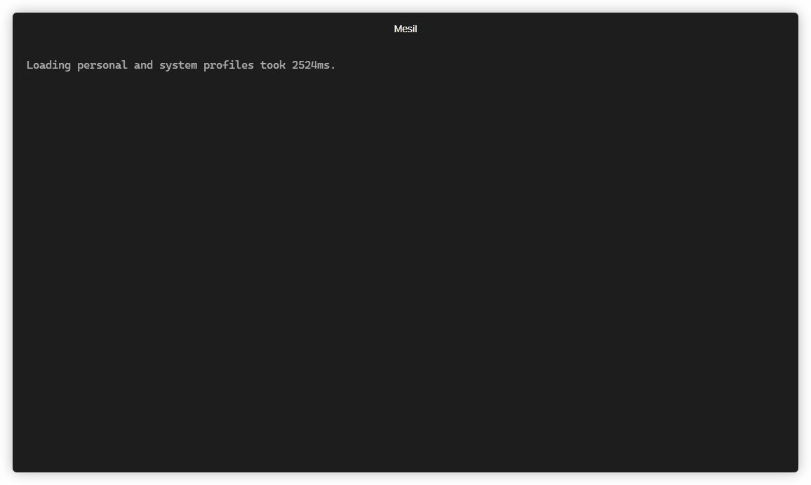

Mesil
==============================

Automate processing and plotting in scientific analyses.


## Installing
Mesil can be installed in the simplest way with `pip` or [pipx](https://pypa.github.io/pipx/) (for an isolated environment).
``` console
pip install mesil
```
``` console
pipx install mesil
```

## Process
The `process` command execute a data cleaning routine specific to the given analysis, infered from path by default or specified in `analysis`.


## Plot
The `plot` command is currently a WIP 🤓!

## About
Mesil originated from my undergraduate research "Fluorescent-labeled mesoporous silica nanorods (MCM-41) for applications in nanomedicine: synthesis and characterization", in partnership with the National Cancer Institute (INCA). The CLI was motivated by my necessity of repeatedly analyze various data from materials characterization.
